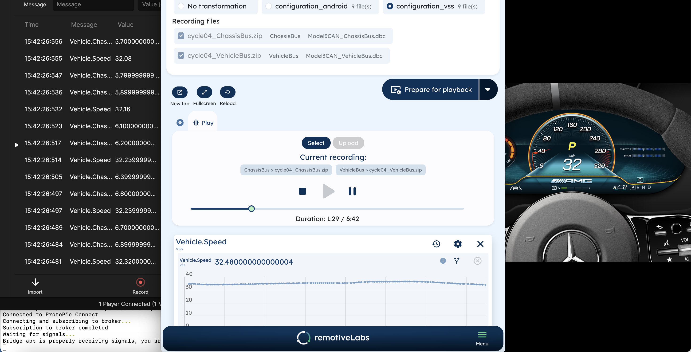
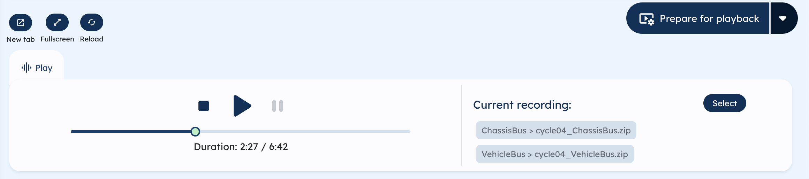
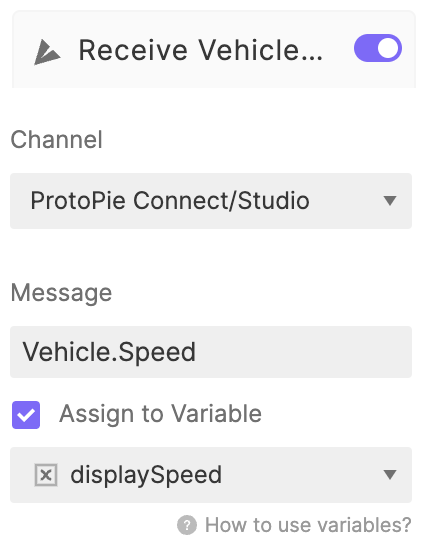

# RemotiveLabs + Protopie

Use our RemotiveCloud together with Protopie and feed real vehicle signals into your prototype.

Read [this blogpost](https://www.protopie.io/blog/challenging-the-status-quo-in-automotive-prototyping) for a good introduction.



## Try it out yourself

This solution requires [Protopie-Connect](https://www.protopie.io/learn/docs/connect/getting-started) which in turn requires a Protopie Pro or Enterprise [plan](https://www.protopie.io/plans).
<hr />

Here is a video that goes through each step in this README, its highly recommended
to watch this video to get a better understanding of how it works.
**[Show video with complete demo (6 min)](https://drive.google.com/file/d/1dG7x7oGb7BTTzivjrDZOmaoydUuraiGW/view?usp=sharing)**


## Prepare recording in RemotiveCloud

The first step is to create a [free account at RemotiveCloud](https://cloud.remotivelabs.com) or use an existing account. When creating a free account you will get some sample drivecycles with real vehicle data automatically. Existing users can click the "import" button in the top right corner under "Recordings" to get the same sample drivecycles.

Next steps:

- Go to recordings, choose which one to use and prepare that recording for plackback (by clicking the "Prepare for playback"-button). Make sure to use "configuration_vss" if you want to use VSS.
- Play the recording

## Connect to ProtoPie Connect

Our ProtoPie Connect bridge is setup using RemotiveCLI, read about [installation of the CLI](https://docs.remotivelabs.com/docs/remotive-cli/installation) and details about how to [connect to ProtoPie Connect](https://docs.remotivelabs.com/docs/remotive-cli/cli_man_pages#remotive-connect-protopie).

In RemotiveCloud you can find a _examples to subscribe to signals from an external application_ section where you will get the CLI snippets needed to get going with connecting to ProtoPie Connect and subscribing to the signals needed to get our sample Pies running.

In short, this is how it looks:
```
remotive connect protopie \
    --signal vss:Vehicle.Chassis.SteeringWheel.Angle \
    --signal vss:Vehicle.Speed \
    --broker-url https://my_cloud_broker \
    --api-key xxx
```

### Control the recording

Once the connection is setup, you can play the recording from the RemotiveCloud and see the messages in ProtoPie Connect.
You can now control the recording with play, pause & stop and also drag the progressbar back and forth to seek to specific place in the recording.



## Run sample Pies

The final step to actually seeing the signals come to life is to connect it to a Pie. Start by downloading one of these two sample Pies (make sure to use the VSS one if you are playing a recording with a VSS transformation).

- [AMG_GT_Cluster_Gauge.pie](https://github.com/remotivelabs/remotivelabs-protopie/blob/main/samples/AMG_GT_Gauge_Cluster.pie) - use when you start any of our drivecycles with "raw" signals (no transformation)
- [AMG_GT_Gauge_Cluster_VSS.pie](https://github.com/remotivelabs/remotivelabs-protopie/blob/main/samples/AMG_GT_Gauge_Cluster_VSS.pie) - use if you run a drivecycle with VSS transformations (configuration_vss)

Next open/import the Pie in you ProtoPie Connect app, preview it and press play in RemotiveCloud. You should now see the Pie come to life!

## Run your own Pies with real vehicle data

It is easy for you to connect your own Pies/prototypes in the same way that we connected the Pies in the above example. Just use the "Recieve" functionality in ProtoPie and the channel "_Protopie Connect/Studio_". Also make sure you use the correct message name when connecting your Pie through the ProtoPie Connect bridge.




Now you are all set to use **real vehicle data** when testing your prototypes!


Please do not hesitate to use our [discussion/community forum](https://github.com/remotivelabs/remotivelabs-community/discussions) for questions regarding this or to contact us at support@remotivelabs.com if you have any questions.
