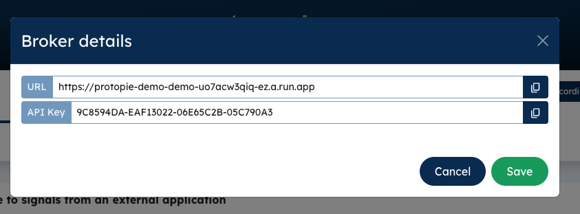
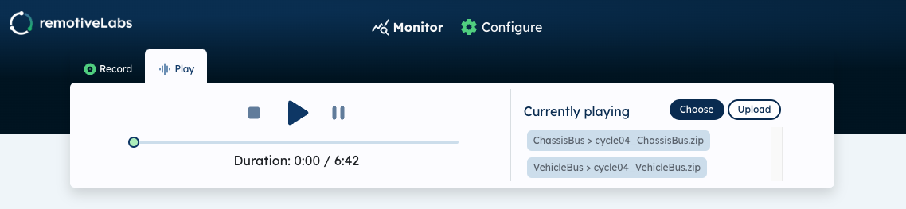

# RemotiveLabs and Protopie

Use our RemotiveCloud to integrate with Protopie

https://www.protopie.io/blog/challenging-the-status-quo-in-automotive-prototyping


## Try it out yourself

This solution requires [Protopie-Connect](https://www.protopie.io/learn/docs/connect/getting-started) which in turn requires a Protopie Pro or Enterprise [plan](https://www.protopie.io/plans).


<hr />

Here is a video showing how to start the recording in RemotiveCloud, its highly recommended to watch this video since it performs every step required.

https://drive.google.com/file/d/1dG7x7oGb7BTTzivjrDZOmaoydUuraiGW/view?usp=sharing


## Prepare recording in RemotiveCloud

1. Go to https://demo.remotivelabs.com and approve the captcha.
2. Follow instructions to start a broker and play the recording to the broker.
3. Finally press "Go to broker" to open our RemotiveBrokerApp from which you can control the recording being played.


## Start connect bridge

**The steps above must be performed before starting the bridge-app since we the bridge-app will try to connect to the cloud**

*Requires node 18.3 or higher*

1. Make sure that protopie-connect is up and running!

2. Install deps
```sh
npm install
```

3. Start bridge-app

Replace $BROKER_URL and $API_KEY below with the correct values found in RemotiveBrokerApp



```sh
node src/remotivelabs-bridge-app.js \
    --url $BROKER_URL \
    --api_key $API_KEY \
    --config samples/instrument-cluster-config.json
```

### Play the recording

Once the bridge-app is running you can "play" the recording from the RemotiveBrokerApp. 
Simply press the play icon and you should see the progressbar moving. There should also be 
message visible in protopie-connect and in the terminal where the bridge-app was started.
This means that the recording is being replayed properly. You can now control the recording
with Play, Pause & Stop and also drag the progressbar back and forth to seek to specific place in the recording.



## Run Pie

There are two bundled *pies* with this demo, one with only speed 
(car-integration-just-speed.pie) and a bigger instrument cluster with gear, steering wheel direction and more (car-integration-instrument-cluster.pie). Both works out-of-the-box so you can pick any of them or run both.

* You should now see signals showing up in Protopie connect.
* Add car-integration-just-speed.pie to ProtoPie connect and start it in web-browser.
* That should be it!

## Troubleshooting


### Connect failure

* Mostly, the reason is that there is no broker listening to the url you have provided. Please check the url of the broker again.

```
Failed to connect to broker
13 INTERNAL: Received RST_STREAM with code 0
```


* Check your APP_KEY so that matches


```
Failed to connect to broker
2 UNKNOWN:
```

Please do not hesitate to use our discussion/community forum for questions regarding this.

https://github.com/remotivelabs/remotivelabs-community/discussions


