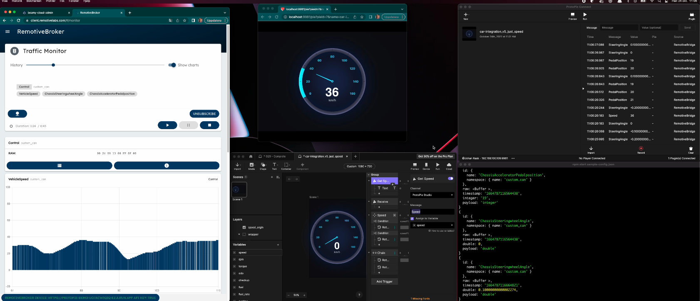

# RemotivelLabs and Protopie

RemotiveBroker integration using Protopie connect



Video showing how they work together

https://drive.google.com/file/d/1fmmZ5O9-L662JSRRaiTEPyP4aii77r7Z/view?usp=share_link

## Test it out

### Start recording in cloud


Here is a video showing how to start the recording in RemotiveCloud

https://drive.google.com/file/d/1m8pfbSK_9-iaI2JSssdcok8O8nYs0mIM/view?usp=share_link

* Go to https://cloud.remotivelabs.com and login.
* Go to https://cloud.remotivelabs.com/p/protopie-collab/recordings/4256668064375193000 and press "play" button, choose broker "protopie-demo".
* Next, click "Explore" to open RemotiveBrokerApp in a separate tab. Optionally subscribe to some channels and start the recording. Use can start, stop, pause the recording.

**NOTE! The recording must be enabled on the broker before starting the bridge**

### Start connect bridge
```
npm install
npm start sample-config.json
```
## Run Pie

* You should now see signals showing up in Protopie connect.
* Add car-integration_v5_just_speed.pie to ProtoPie connect and start it in web-browser.
* That should be it!


## Config

```
{
  "broker": {
    "url": "https://protopie-demo-protopie-collab-sglnqbpwoa-ez.a.run.app",
    "apiKey": "protopie-demo"
  },
  "subscription": {
    "VehicleSpeed": {            <- Name in vehicle bus
      "namespace": "custom_can",
      "mapTo": "Speed"           <- Name in protopie connect
    }
  }
}
```
